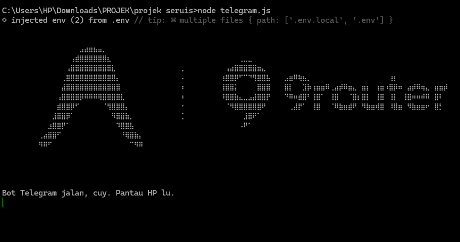

# 9router-login-AG-X-SBMod



A fully automated, headless integration bridge utilizing Puppeteer and Telegram to securely bypass Google authentication and inject active sessions into 9Router. Features human-like evasion mechanics such as dynamic delays and virtual cursor movements.

## Features
- **Stealth Mode Puppeteer**: Google reCAPTCHA evasion and automated fingerprint obfuscation.
- **Virtual Mouse Injection**: Simulates human cursor movements and realistic DOM interactions.
- **Telegram Remote Interface**: Complete command and control over the pipeline via Telegram bot API.
- **Auto-Clean & Logging**: Automatically purges processed targets and outputs success metrics to `berhasil.txt`.
- **Heuristic Delays**: Dynamic execution pacing (10s - 30s) to mimic human behavioral patterns.

## Prerequisites
- Node.js (v18+)
- Active 9Router instance (Port 20128/`http://localhost:20128`)

## Installation
1. Clone this repository.
2. Install dependencies:
   ```bash
   npm install
   ```
3. Initialize the environment file (`.env`) in the project root:
   ```env
   TELEGRAM_BOT_TOKEN=YOUR_BOT_TOKEN
   TELEGRAM_ADMIN_ID=YOUR_TELEGRAM_ID
   ```
   *Note: `.env` is safely ignored in `.gitignore`.*

## Usage
1. Initialize the worker daemon:
   ```bash
   node telegram.js
   ```
2. Open the Telegram interface and send `/start` or `/menu`.
3. Add targets using **Tambah Akun** (supports bulk insert via newline).
4. Select target sessions via **Pilih Akun & Login**.
5. Let the worker execute the queue autonomously.

*Author: Azrial Galih Prasetyo*
*Instagram: @al.sebirumatahari_*
*Telegram: @sbmshop*
